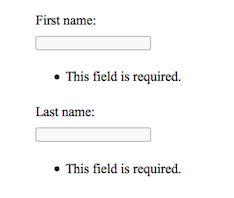
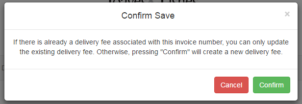

Preventing data duplication with HTTPResponse Redirects and Bootstrap Modals
=======================================================================

### Purpose of the tutorial
----------

Django provides a lot of built-in functionality through their generic class-based views. One functionality is handling of form validation errors. For example, if a user tries to submit data in a form for a model that duplicates the information contained in an existing model, the Django messaging framework can be used to display a quick and simple error message. However, the error message appears as an unpleasant-looking bulleted list and offers no quick solution to the user. 



*Figure 1: Django default rendering of form validation errors*

To enhance the user experience, we can utilize Bootstrap Modals and HTTPResponse Redirects. This tutorial will demonstrate how to detect data duplication, warn the user before he or she submits the form, and redirect the user to an Edit view if they attempt to create a new model with data duplication. The user will then easily be able to update the already existing model, instead of having to find it on their own.

### Setting up models.py
----------
Let's use the example of a DeliveryFee model, with two attributes: an invoice number and a delivery fee.

* models.py  
```
from django.db import models

class DeliveryFee(models.Model):
    invoice_number = models.CharField(max_length=50, unique=True)
    fee = models.DecimalField((max_digits=10, decimal_places=2)
```
By setting ```unique=True``` for the invoice number, Django will ensure that no delivery fee with the same invoice number can exist.

### Setting up views.py for redirection
----------
In your views.py, make sure you have the necessary imports.

* views.py  
```
from django.views.generic.edit import CreateView
from django.urls import reverse_lazy
from myapp.forms import DeliveryFeeCreateForm
from myapp import models

```
Create a CreateView in your views.py similar to the one below, where you specify a template, model, form, and success URL.

* views.py  
```
class DeliveryFeeCreate(CreateView):
    template_name = "myapp/delivery_fees/delivery_fee_create.html"
    model = models.DeliveryFee
    form_class = DeliveryFeeCreateForm
    success_url = reverse_lazy('view_delivery_fees')
    ....
```
In the CreateView, create form_valid and form_invalid functions. The ```form_valid``` function will create a Delivery Fee, as expected, if there is no Delivery Fee with that invoice number currently exists.

* views.py  
```
    def form_valid(self, form):
        ....
        # A delivery fee with that invoice number doesn't exist yet. Create one normally.
        return super(DeliveryFeeCreate, self).form_valid(form)
        ....
```

The ```form_invalid``` function should first get the invoice number from the form and then check your current models for data duplication. If one currently exists, then get the primary key of that Delivery Fee and redirect the user to the Delivery Fee Update page, passing in the primary key as your argument so you know the exact Delivery Fee to edit.
* views.py 
```
    def form_invalid(self, form):
        ....
        invoice_number = form.data['invoice_number']
        check_delivery_fee_exists = models.DeliveryFee.objects.filter(invoice_number = invoice_number)
        if len(check_delivery_fee_exists) > 0:
           # delivery fee with that invoice number already exists. Update instead.
            existing = models.DeliveryFee.objects.get(invoice_number = invoice_number).pk
            return HttpResponseRedirect(reverse("delivery_fee_update", kwargs= {'pk':existing}))
        ....
```
### Setting up your HTML template to include modals
----------
Next, create an HTML template called delivery_fee_create that the CreateView will use. 
Make sure to include Bootstrap in your project for the modal functionality.
> openConfirmSave will toggle the modal

* delivery_fee_create.html
```
<html>
    <head>
        <link rel="stylesheet" href="https://maxcdn.bootstrapcdn.com/bootstrap/3.3.7/css/bootstrap.min.css">
        <script src="https://ajax.googleapis.com/ajax/libs/jquery/3.2.0/jquery.min.js"></script>
        <script src="https://maxcdn.bootstrapcdn.com/bootstrap/3.3.7/js/bootstrap.min.js"></script>
    </head>
    <body>
        <form action="" method="post"> 
            ... Insert code here to display your form ...
                <div class="row">
                    <div class="col-xs-3"></div>
                    <div class="col-xs-3">
                        <a href="" class="btn pull-left btn-danger" value="Cancel">Cancel</a>
                    </div>
                    <div class="col-xs-3">
                        <a name="openConfirmSave" id="openConfirmSave" class="btn pull-right btn-primary" data-toggle="modal" data-target="#confirmSave" )" aria-hidden="true" value="Save" > Save </a>
                    </div>
                    <div class="col-xs-3"></div>
            </div>
            .... Insert Modal code here ....
        </form>
    </body>
</html>
```

Also include a modal in your template:
  
* delivery_fee_create.html
```
<div id="confirmSave" name="confirmSave" class="modal fade" role="dialog">
    <div class="modal-dialog">
        <!-- Modal content-->
        <div class="modal-content">
            <div class="modal-header">
                <button type="button" class="close" data-dismiss="modal">&times;</button>
                <h4 class="modal-title">Confirm Save</h4>
            </div>
            <div class="modal-body">
                <p>If there is already a delivery fee associated with this invoice number, you can only update the existing delivery fee.
                Otherwise, pressing "Confirm" will create a new delivery fee.</p>
            </div>
            <div class="modal-footer">
                <form id="confirm_save" action="" method="post">
                     
                    <button type="button" class="btn btn-danger" data-dismiss="modal">Cancel</button>
                    <input type="submit" style="width:auto; height:auto" class="btn btn-success" value="Confirm"/>
                </form>
            </div>
        </div>
    </div>
</div>
```  



*Figure 2: Modal pop-up before creation*

This concludes the tutorial! You have successfully used Bootstrap Modals and HTTPResponse Redirects to detect data duplication, warn the user before he or she submits the form, and redirect the user to an Edit view if they attempt to create a new model with data duplication.
